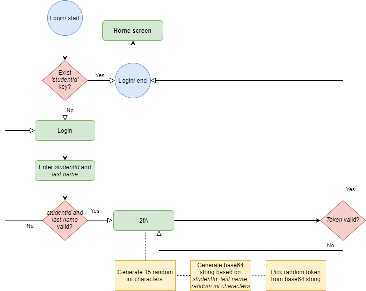
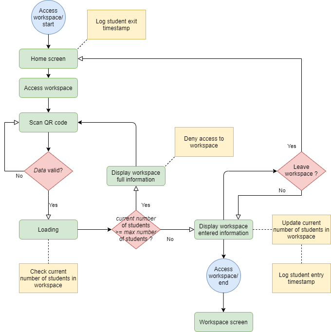

## Certificates 

This project is part of the evaluation of the course ‘Mobile Information Systems’ during 
the summer semester of 2021 at the [Fachhochschule Aachen](https://www.fh-aachen.de/fachbereiche/elektrotechnik-und-informationstechnik/international/studying-at-fb5/).

## Context
The certificates app is to be used by students from [LUCA School of Arts](https://www.luca-arts.be/en) and the persons 
responsible for the workplaces in the school.

In the workplaces students can use different machines while working on their projects. 
Typical machines are sawing machines, milling machines, electrical screwdrivers, 3D printers, 
laser cutters,…Certain equipment can be used without instruction, but other, more specialized, 
equipment may only be used when some training has been followed successfully. 

To prove that a student has the required knowledge to use a certain machine of 
equipment, he/she receives a certificate. These certificates will be provided digitally only. The 
app will allow to check that the student has the certificate

## Flow
#### Login with 12fA:

1. The generated **token** could either be send per email/ phone number to the student or be displayed via a authenticator application. _In this case we assumed that the token was send per email to the student_.

#### Access workspace with QR code:

## Technologies
Project is created with:
* Flutter version: 2.0.6 (Channel stable)
* Dart: 2.12.3
* Firebase Firestore: latest
* Android SDK version: 30.0.3

Using _Visual Studio Code_ as editor please ensure to install the **"Better Comments"** extension (Version 2.1.0).

## Foot notes:
* 1[2fA]: Two factor authentication

### _More information coming soon_
